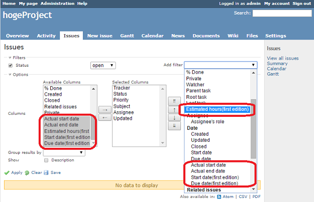
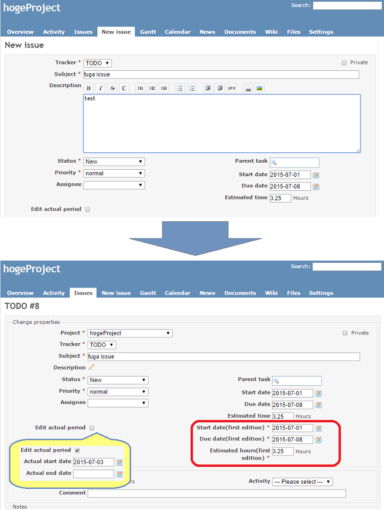
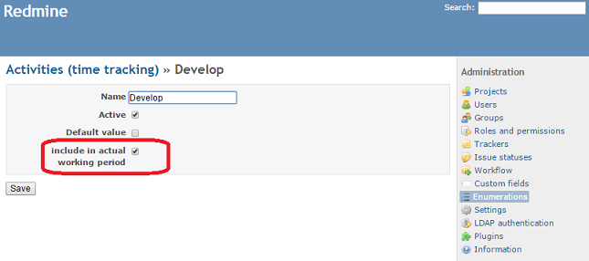

# redmine_actual_period
This plugin enables you to view actual working period (which automatically calculated on time entry records).

1. 工数入力をもとに、チケットの実績開始日と実績終了日を計算し、表示します。

  実績開始日と実績終了日はそれぞれ、自動計算対象の工数入力の日付の一番古いものと新しいものです。
  
  自動計算された実績開始日と実績終了日は、チケット編集画面で変更できます。
  
  管理画面にて、自動計算の対象とする工数の活動を設定できます。

1. 最初に入力した予定工数、開始日、期日を自動的に保存し、表示します。

  自動保存された予定工数、開始日、期日は、チケット編集画面で変更できます。

Screen shots
------------------

Search screen



Edit screen



Settings screen



Installation
------------------

1. Download zip-file
1. ```cd {redmine_root}/plugins```
1. Expand the plugin into the plugins directory ( Name must be "redmine_actual_period" )
1. ```cd {redmine_root}```
1. ```bundle exec rake redmine:plugins:migrate NAME=redmine_actual_period RAILS_ENV=production```
1. Restart Redmine

Supported versions
------------------

* Redmine 2.6.x
* Redmine 3.0.x
